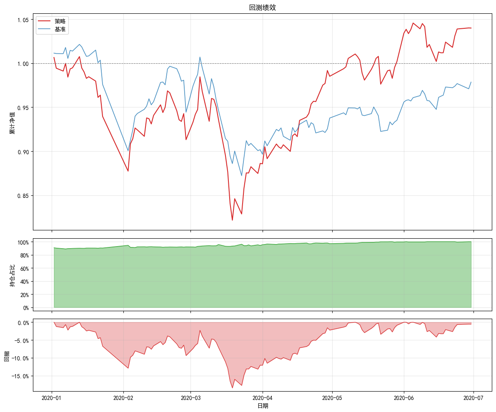
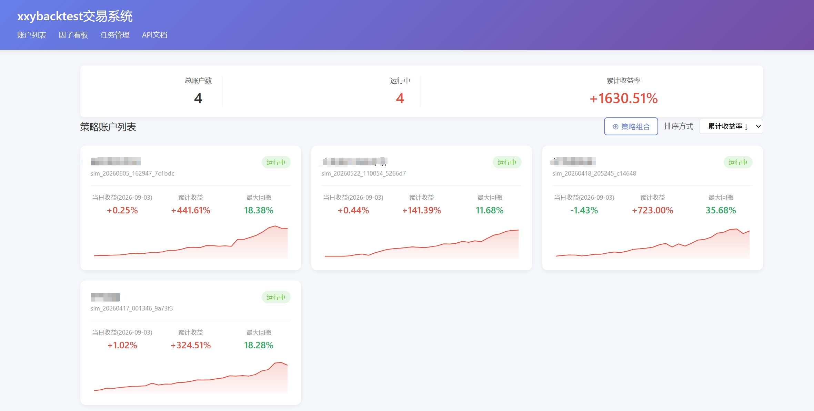
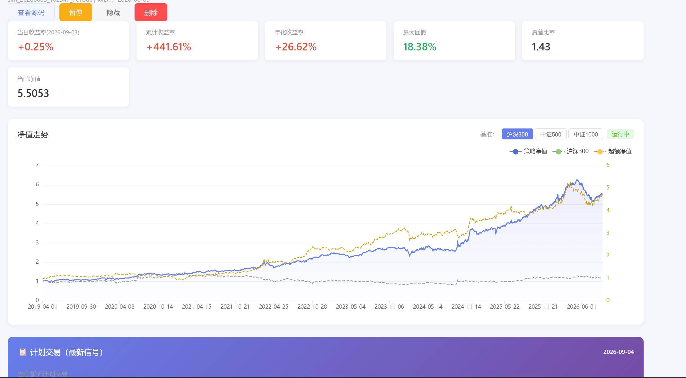

# xxybacktest

> 写一次策略，回测 → 模拟 → 实盘自动跑。一个框架打通量化交易全流程。

[](LICENSE)
[](https://www.python.org)
[]()

## xxybacktest 能做什么（不止三件事）

| 📊 回测 | 🔁 模拟盘 | 💹 实盘自动跑 | 🔬 因子分析 |
| --- | --- | --- | --- |
| 日频策略历史回测，内置交易规则、分红除权、绩效分析 | 策略提交为模拟账户，每日自动重跑生成信号，Web 面板查看净值 / 持仓 | 对接 QMT 真实账户，定时自动下单（miniQMT 直连 / 大QMT 桥接双后端） | 一条因子 SQL 自动算 IC / ICIR / 分组收益 / 多空曲线，支持 notebook 即时分析或入库每日监控 |

> 除了这四类核心能力，期货 / 期权 / 可转债等品种支持也在规划中。

## 30 秒上手

```bash
pip install -e .
```

```python
from xxybacktest import run_backtest

def initialize(context):
    context.universe = ["000001.SZ", "600519.SH"]
    context.run_daily(handle_data, "9:30")

def handle_data(context):
    for code in context.universe:
        context.order_target_percent(code, 0.5)

result = run_backtest(
    initialize=initialize,
    handle_data=None,
    start_date="2020-01-01",
    end_date="2020-06-30",
    capital=1000000,
    data_path="./data",   # 仓库内置示例数据（全市场 2020 上半年）
    benchmark="000001.SH",
    plot=True,
)
```

> 📦 **示例数据已内置**：仓库 `data/` 目录含全市场 2020 上半年（股票 + 基金）回测必要数据，clone 下来即可直接跑通上面的示例。换成你自己的全量数据时，把 `data_path` 指向你准备的数据目录即可（目录结构见[部署与数据](docs/guide/部署与数据.md)）。



## 回测示例（Demo）

下面每个示例都是独立可运行的 **Jupyter Notebook**，基于仓库内置示例数据（2020 上半年），**已预执行、回测曲线与绩效表直接内嵌**，离线打开就能看图；想改策略，用 Jupyter 打开 `examples/<文件名>.ipynb`、选带 `xxybacktest` 依赖的内核（如本机 `xxybacktest (vnpy)`）「运行所有单元格」即可重跑。

| 策略名称 | 策略代码（Notebook） |
| --- | --- |
| 买入持有（沪深300ETF） | [examples/demo_buy_hold_etf.ipynb](examples/demo_buy_hold_etf.ipynb) |
| 双均线交叉（贵州茅台） | [examples/demo_ma_cross.ipynb](examples/demo_ma_cross.ipynb) |
| ETF 月定投（沪深300ETF） | [examples/demo_etf_dca.ipynb](examples/demo_etf_dca.ipynb) |
| 蓝筹等权组合 | [examples/demo_bluechip_equal_weight.ipynb](examples/demo_bluechip_equal_weight.ipynb) |

## 效果展示

下面是 **xxybacktest 交易系统** 的前端截图，账户列表总览 + 单个策略详情页。仅供展示系统能力。





> 实际使用时，你可以把自己的策略提交为模拟/实盘账户，每天自动重跑并在这里看到净值、持仓、计划交易。详情见[模拟盘指南](docs/guide/模拟盘指南.md)。

## 两条实盘路线

| 路线 | 适合场景 | 配置难度 |
| --- | --- | --- |
| **miniQMT 直连** | 本机装了 miniQMT 客户端 | 简单：填 `qmt_path` 即可 |
| **大QMT 桥接** | 本机无 miniQMT、或大QMT 独占 | 中等：部署桥接服务端 + 填账号 |

→ 详细步骤见 [桥接实盘指南](docs/guide/桥接实盘指南.md)

## 📚 文档导航

- [回测指南](docs/guide/回测指南.md) — 安装、参数、下单函数、历史行情、费率滑点、股票 vs 基金差异
- [模拟盘指南](docs/guide/模拟盘指南.md) — 提交策略、Web 面板、账户管理、API、部署
- [部署与数据](docs/guide/部署与数据.md) — 数据目录结构、各表字段、生产部署
- [桥接实盘指南](docs/guide/桥接实盘指南.md) — miniQMT / 大QMT 双后端从零配置
- [因子分析指南](docs/guide/因子分析指南.md) — 一条 SQL 算 IC / ICIR / 分组收益 / 多空曲线

## ⚠️ 风险提示

实盘交易有风险，本框架仅提供工具，**不构成投资建议**。实盘下单前请务必先用小资金验证（建议 100 股测试单），确认「下单 → 回报 → 撤单」整条链路通畅。所有回测 / 模拟结果均为研究用途，不等于实盘收益。

## 开源信息

- **License**：[MIT](LICENSE)（详见仓库根 `LICENSE` 文件）
- **反馈 / 贡献**：欢迎提 Issue 与 PR
- 期货、期权、可转债支持正在规划中

## 项目总览

xxybacktest 是一套面向 A 股的量化研究框架，核心理念是「写一次，全流程复用」：同一套策略代码、同一套数据接口，可以在回测、模拟、实盘、因子分析之间无缝衔接，避免重复造轮子。

模块结构（纯文字说明，无架构图）：

- **数据层**（`xxybacktest/data.py` + `xxydb`）：统一读取 `daily_bar` / `daily_fund` / `trading_days` 等表，回测与因子分析共用同一份数据口径。
- **回测引擎**（`xxybacktest/backtest.py`）：日频事件驱动引擎，内置撮合规则、分红除权、费率滑点、绩效分析（年化 / 夏普 / 最大回撤等）。
- **模拟盘系统**（`xxybacktest/simulation/` + `xxybacktest/web/`）：把策略提交为模拟账户，按调度每日自动重跑产出信号，Web 面板查看净值、持仓、订单。
- **实盘双后端**（`xxybacktest/live/`）：miniQMT 直连 + 大QMT 桥接，对接真实账户定时自动下单。
- **因子分析**（`xxybacktest/factor/`）：你只写一条「返回 `date` / `instrument` / `value`」的因子 SQL，系统自动做截面预处理（去极值 + 标准化）、算 rank IC / ICIR、分组收益与多空曲线，支持 notebook 即时分析或入库每日监控。

数据口径要点：因子收益采用「次日开盘 + 后复权」口径，因子对齐日为 T 日收盘后，最早 T+1 开盘成交，零未来函数；可交易过滤内置停牌 / ST / 涨跌停。详情见[因子分析指南](docs/guide/因子分析指南.md)与各模块源码。
