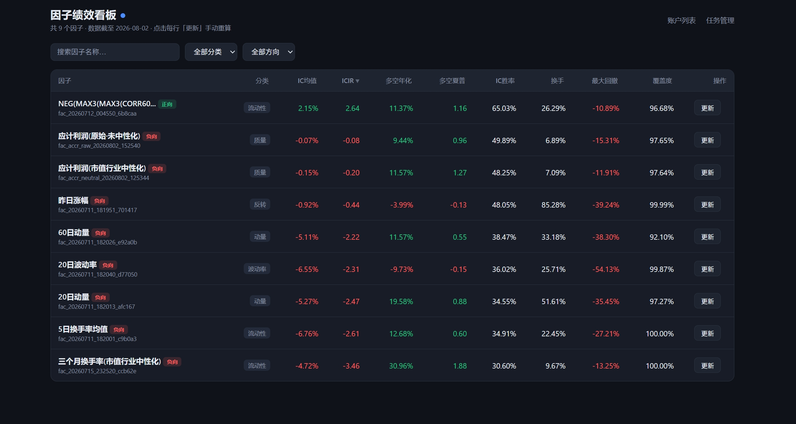

# 因子分析指南

xxybacktest 不止能做回测 / 模拟 / 实盘，还内置了独立的**因子分析模块**（`xxybacktest.factor`）。你只需写一条「因子 SQL」，系统自动算 IC / ICIR / 分组收益 / 多空曲线，所有口径与回测保持一致。

> 适合谁：想验证某个因子（价值、成长、动量、质量……）是否真的有效，或者搭建因子监控看板的人。

## 1. 快速开始（即时分析）

```python
from xxybacktest.factor import analyze_factor

# 因子 SQL 必须返回三列：date（日期）/ instrument（标的）/ value（因子值）
# 下面以「日收益率反转」为例：今天涨得多的，明天容易跌（示意）
sql = "SELECT date, instrument, close/pre_close - 1 AS value FROM daily_bar"

res = analyze_factor(sql=sql, data_path="./data", name="日收益率反转")
res.summary()       # 打印 IC / ICIR / 分组收益等核心指标
res.plot_groups()   # 画分组净值与多空曲线
```

大白话说明：

- 因子 SQL 只负责「算出因子值」，必须返回 `date` / `instrument` / `value` 三列。股票池筛选、行业 / 市值中性化都在你的 SQL 里自行处理。
- 系统自动做的：截面去极值（MAD）+ 标准化（zscore）、算 rank IC（Spearman）/ ICIR、按因子值把全市场分成 10 组算每组未来收益、画多空曲线。
- 收益口径：T 日收盘后算因子，最早 T+1 开盘才能成交，采用后复权价——零未来函数。
- 可交易过滤内置：自动剔除停牌 / ST / 涨跌停标的。

## 2. 入库监控（每日重跑）

如果你想把因子纳入每日监控看板，用「提交 + 重跑」模式：

```python
from xxybacktest.factor import submit_factor, run_all

fid = submit_factor(name="日收益率反转", sql=sql, category="反转")
run_all(data_path="./data")   # 定时任务每天调用，刷新前端监控看板
```

- `submit_factor`：把因子登记进库（名称、SQL、分类）。
- `run_all`：重跑所有已登记因子并落盘，供 Web 监控看板展示。
- 即时分析与入库监控**共用同一个计算引擎**（`engine.py`），口径永远一致。

## 3. 结果长什么样

把因子提交并运行后，前端「因子看板」会列出每个因子的核心绩效：



看板指标说明：

- **IC 均值 / ICIR**：因子值与未来收益的相关性强度与稳定性。
- **多空年化 / 多空夏普**：做多头部组 + 做空尾部组的收益表现。
- **IC 胜率**：因子方向预测正确的交易日占比。
- **换手 / 最大回撤 / 覆盖度**：辅助判断因子可交易性与风险。

## 4. 数据依赖

只需 `daily_bar` + `stock_status` 两张表——仓库内置示例数据（`data/`）已包含，无需额外准备即可直接跑上面的示例。

## 5. 参数速查

`analyze_factor(...)` 常用参数：

| 参数 | 含义 | 默认 |
| --- | --- | --- |
| `periods` | 算未来 N 日收益的周期 | `(1, 5, 10, 20)` |
| `n_groups` | 分组回测的组数 | `10` |
| `ic_method` | `'rank'`（Spearman，抗异常值）或 `'normal'`（Pearson） | `'rank'` |
| `base_period` | 分组 / 多空 / 汇总用哪个周期 | `periods[0]` |
| `winsorize` / `standardize` | 截面去极值 / 标准化开关 | 默认开 |
| `exclude_suspended` / `exclude_st` / `exclude_limit` | 剔除停牌 / ST / 涨跌停 | 默认开 |
| `with_horizon` | 是否算因子有效时限（IC 衰减曲线 + 半衰期） | `False`（即时分析秒回） |

## 6. 模块结构

- `xxybacktest/factor/api.py` — 即时分析入口 `analyze_factor`
- `xxybacktest/factor/engine.py` — 计算引擎（去极值、IC、分组，纯函数）
- `xxybacktest/factor/result.py` — `FactorResult`（`.summary()` / 画图）
- `xxybacktest/factor/store.py` / `submitter.py` — 因子入库与登记
- `xxybacktest/factor/runner.py` — `run_single` / `run_all` 定时重跑
